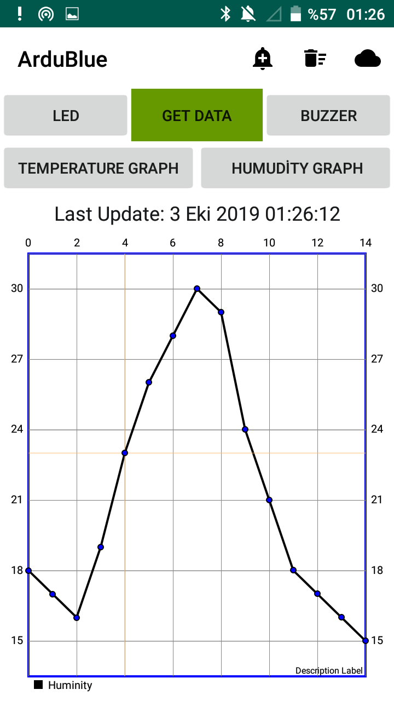
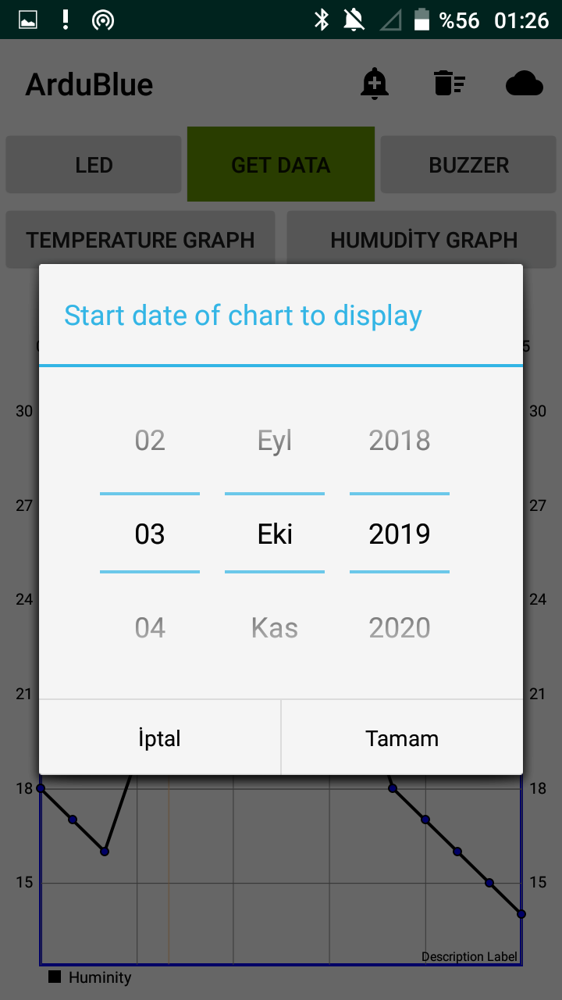
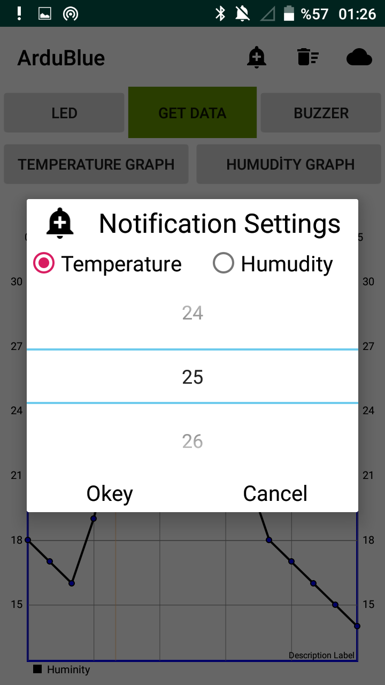

## ArduBlue
***Android Application written to transmit and receive data by connecting via bluetooth to another device (Arduino, Raspberry Pi, etc.). Graphing all of the received data.
Datas from temperature, humidity, acceleration and pressure sensors can be given as examples.***
## Instant Graphics

## History

## Notification

